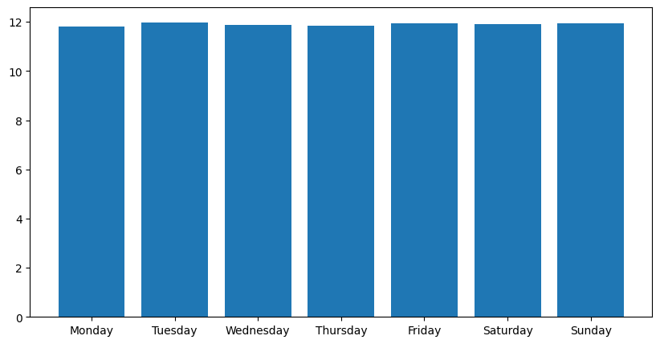
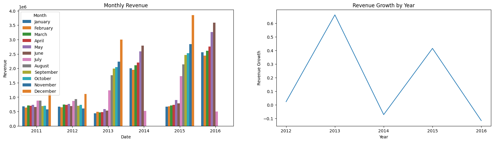
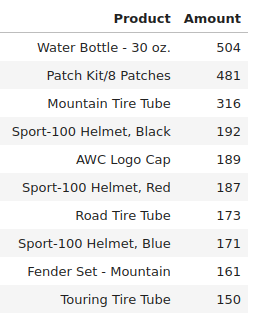
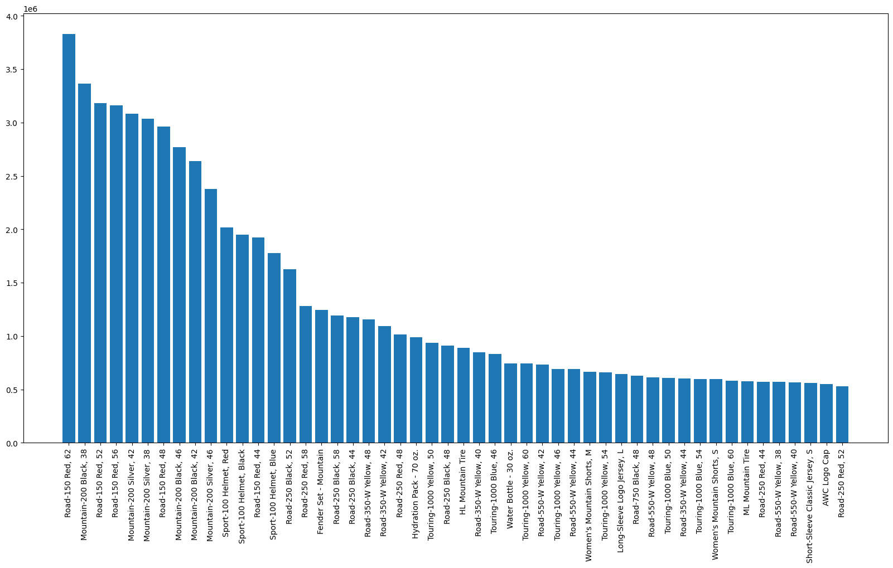
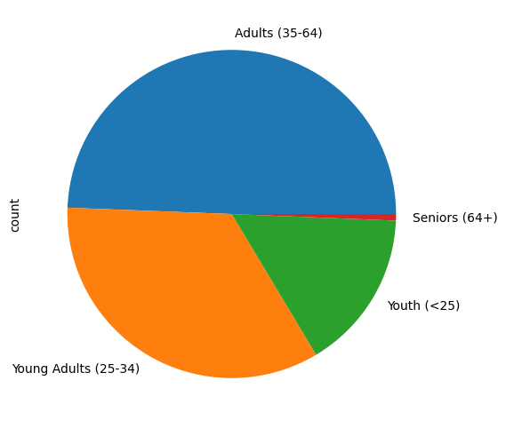

# Bike Shop Sales
The project demonstrates data analysis opportunities with Python and Pandas using sales data from a bike shop as an example. Dataset contains info on 113036 orders with customer details, geography and finance for several years. Numerical and categorical analyses are carried out to identify trends, target audiences and gain insights. You may preview the notebook [here](https://nbviewer.org/github/alexstulov/bike-shop-sales/blob/main/src/bs-analysis.ipynb).

## Numerical analysis

Sales are evenly distributed during the days of the week.

Peak sales occur in December (Christmas and New Year) every year.

The biggest sales are water bottles and camera patch kits.

The main income comes from the sale of adult road bikes and children's mountain bikes, mainly in red and black.

## Categorical analysis

The target audience is represented by young adults (25-34) and adults (25-64) who make >75% of the store's customers.

